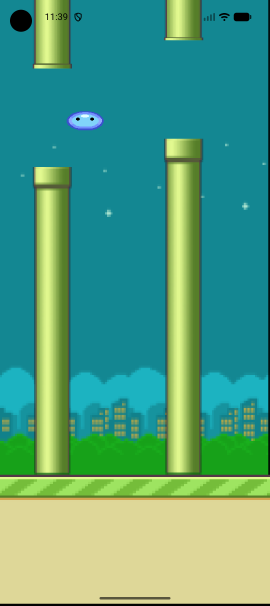

# Jumper Game

[](https://flutter.dev)
[](https://flame-engine.org)
[](https://dart.dev)
[]()

> A side-scrolling jumper game built with Flutter & Flame Engine - tap to jump, avoid pipes, and beat your high score!


*[]*

## 🎮 About The Project

**Jumper** is an addictive endless runner game where you control a character navigating through procedurally generated pipes. Built entirely with Flutter and the Flame game engine, it demonstrates real-time collision detection, infinite scrolling mechanics, and responsive touch controls.

### Technical Highlights
- ⚡ Real-time game loop
- ♾️ Endless procedural level generation
- 📱 Cross-platform (iOS & Android)

## 🛠️ Built With

| Category | Technologies |
|----------|-------------|
| **Framework** | Flutter 3.16+ |
| **Game Engine** | Flame 1.11+ |
| **Language** | Dart 3.0+ |
| **Collision** | Flame Forge2D |
| **Rendering** | Custom Sprite Components |

## ✨ Features

- **Infinite Scrolling** - Ground and obstacles scroll continuously
- **Procedural Generation** - Pipes spawn randomly with varying heights
- **Collision Detection** - Real-time hitbox detection for ground and pipes
- **Game States** - Start screen, active gameplay, and game over states
- **Responsive Controls** - Tap anywhere to jump

## 📸 Visual Preview

| Start Screen | Gameplay | Game Over |
|-------------|----------|-----------|
|  |  |  |

## 🚀 Getting Started

### Prerequisites

```bash
# Install Flutter SDK
curl -s https://raw.githubusercontent.com/flutter/flutter/main/install.sh | bash

# Verify installation
flutter doctor

# You should see:
✓ Flutter (Channel stable, 3.16+)
✓ Android toolchain
✓ iOS toolchain
✓ Android Studio / VS Code